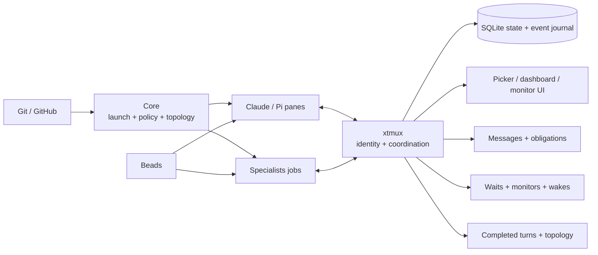
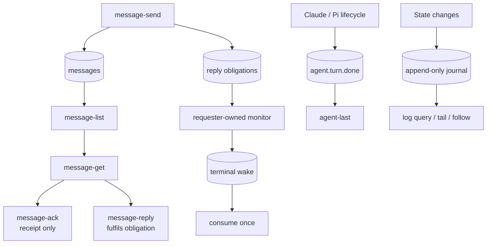

# xtmux

[](https://www.npmjs.com/package/@jaggerxtrm/xtmux)
[](LICENSE)

> [!WARNING]
> **Documentation freshness**
>
> xtmux is evolving quickly. Long-form documentation can lag behind the current runtime.
> For the exact revision or installed version you are using, treat these as the operational authorities:
>
> 1. the source and generated contracts at that revision;
> 2. `xtmux help`, `xtmux <command> --help`, and `xtmux-obs --help`;
> 3. the canonical `/multiplexing` and `/multiplexing-team` skills shipped by Core;
> 4. `CHANGELOG.md`, release notes, and merged pull requests.
>
> The README is an orientation surface, not a substitute for the live command contract. For development or integration work, clone and inspect xtmux, Core, and Specialists together rather than relying only on npm package contents.

> [!NOTE]
> **Naming**
>
> **XTRM** is the whole stack. **Core** is its control-plane component. The npm name `xtrm-tools` is only Core's transitional package name and is planned for retirement as Core, Specialists, and xtmux converge into the XTRM monorepo.

**xtmux is a tmux-native runtime and coordination layer for humans and coding agents.**

It combines:

1. an interactive session and pane UI;
2. durable agent identity and lifecycle state;
3. SQLite-backed messages, reply obligations, waits, monitors, wakes, completed-turn retrieval, topology, and an append-only event journal.

The original fzf picker is still important, but it is now one surface of a broader local coordination substrate.

## Position in the XTRM stack



| Component | Responsibility |
|---|---|
| **xtmux** | Local runtime identity, lifecycle, coordination, and event delivery |
| **Core** | Launch, policy, worktree control, aggregate topology, and installation |
| **Specialists** | Managed role jobs and structured results |
| **Beads** | Durable task contracts and notes |

## Three primary surfaces

### Human tmux interface

The picker provides:

- session and pane discovery;
- fzf filtering and previews;
- attention-first ordering;
- inline rename and safe kill actions;
- popup attachment;
- repository, branch, command, and content filters;
- Specialist and agent-state badges;
- worktree collision warnings.

```bash
xtmux
xtmux list waiting
xtmux list 'repo:core,cmd:agent'
xtmux dashboard sessions-only
```

### Agent identity and lifecycle

Claude and Pi hooks/extensions publish pane-scoped runtime metadata:

- agent instance identity;
- runtime state;
- Bead and role;
- parent/coordinator lineage;
- worktree and branch;
- completed-turn summaries and exact stored turn output.

Canonical lifecycle states include:

```text
running · needs-input · done · idle · off
```

A lifecycle state is not task completion. Task completion belongs to Beads, Specialist terminal status, and GitHub/CI evidence.

### Durable coordination

xtmux provides local, typed coordination between sessions and panes:

- durable messages;
- receipt acknowledgement;
- reply obligations;
- correlated replies;
- requester-owned waits;
- background monitors;
- one-time wake consumption;
- exact message retrieval;
- exact completed-turn retrieval;
- append-only event journaling;
- read-only topology and bridge surfaces.

## Architecture



## Quick start

Install:

```bash
npm install --global @jaggerxtrm/xtmux
```

Verify the backend and inspect sessions:

```bash
xtmux-obs health
xtmux dashboard sessions-only
xtmux monitors
```

Send a durable reply-required message:

```bash
xtmux message-send \
  --to '$42' \
  --to-pane '%7' \
  --bead demo.1 \
  --text 'Please inspect the failing validation and reply with the result.' \
  --json
```

List pending messages for the current pane:

```bash
xtmux message-list \
  --pane "$TMUX_PANE" \
  --unacked \
  --expects-reply \
  --json \
  --limit 5
```

Retrieve and fulfil one message:

```bash
xtmux message-get <message-key> --json

xtmux message-reply \
  --in-reply-to <message-key> \
  --text 'Validation completed; see the linked evidence.' \
  --json
```

Retrieve a completed interactive turn without scraping the pane:

```bash
xtmux agent-last %7 --json
```

Inspect topology and events:

```bash
xtmux topology --json
xtmux log tail 50
xtmux log follow --after-id 0 --json
```

## Messaging contract

These distinctions are load-bearing:

| Operation | Meaning |
|---|---|
| `message-send` | Persist a durable message; it does not inject text into a pane |
| `message-list` | Discover bounded message rows |
| `message-get` | Read one exact message |
| `message-ack` | Record receipt; it does not fulfil a request |
| `message-reply` | Create a correlated reply and fulfil the original obligation |
| `safe-send-pointer --reply-to` | Urgent pane injection plus correlated reply after successful delivery |

A Bead-associated message defaults to `expectsReply=true`. Use `--expects-reply=false` for FYI-only updates.

Message summaries and bodies are untrusted data. Hooks surface bounded identifiers and summaries; they must not turn message text into executable instructions.

## Waits, monitors, and wakes

`wait-agent` and `monitor-agent` are requester-owned. They answer whether the target runtime has left a working state; they do not decide whether the task is complete.

```bash
xtmux wait-agent %7 --wait-for-transition --consume --timeout 30m --interval 30s
xtmux monitor-agent %7 --wait-for-transition --timeout 30m --interval 30s
xtmux monitor-list --json
xtmux monitor-kill <monitor-id>
```

Terminal monitor state overlays the last observed pane state, while the raw pane state remains separately available for diagnosis.

A completed wake is consumed once. Re-arming against a target that is working again creates a fresh wait rather than replaying stale success.

## Claude and Pi integrations

The npm installer places:

- owned Claude hooks under `~/.claude`;
- grouped Pi extensions under `~/.pi`;
- command binaries under the managed local bin path.

Current behavior includes:

- instance identity on session start;
- lifecycle state projection;
- Pi obligation reconciliation;
- no monitor for FYI sends or correlated replies;
- Pi continuation queue before receipt ack;
- Claude and Pi parent FYIs on completed turns;
- bounded Claude Stop-time inbox reminders;
- restart reconstruction from durable state;
- anti-spin and idempotency guards.

The installer is ownership-aware and idempotent. It preserves unrelated user and XTRM-managed entries.

## Event journal and observability

SQLite is the runtime source of truth:

```text
${XDG_STATE_HOME:-$HOME/.local/state}/xtmux/observability.db
```

The journal records typed state, message, monitor, wait, handoff, audit, topology, and agent-turn events.

Useful surfaces:

```bash
xtmux log query --bead <bead-id> --json
xtmux log tail --format human
xtmux log follow --after-id <event-id> --json
xtmux-events
```

Human rendering is additive; JSON/NDJSON remains the machine contract.

## Topology and bridge

`xtmux topology --json` projects host, tmux, session, pane, agent identity, state, role, worktree, branch, and parent-pane metadata.

The stdio bridge exposes bounded asynchronous operations for consumers that cannot or should not open a second tmux connection.

Core’s `xt topology` consumes xtmux data and joins it with Specialists, Beads, Git, and GitHub evidence.

## Picker and compatibility command

`xtmux` is the canonical name for new docs and scripts.

`tmux-session-picker` remains a compatibility alias for the same command surface. The alias reflects the project’s origin; it no longer describes the whole product.

Suggested tmux binding:

```tmux
bind s display-popup -E -w 99% -h 97% "$HOME/.local/bin/xtmux"
```

See [docs/keys.md](docs/keys.md) for additional bindings and collision notes.

## Authority and safety model

- xtmux owns local runtime identity and coordination facts.
- Beads owns task state and durable task memory.
- Specialists owns managed job results.
- Git and GitHub own integration evidence.
- `agent-last` is the completed interactive-turn retrieval surface.
- `sp result` is the managed Specialist-result retrieval surface.
- Pane capture is for live UI/auth/menu/streaming diagnosis only.
- Coordination mutations are bounded and fail visibly or fail open according to their lifecycle contract.

## Current boundaries

- xtmux is local and tmux-native; it is not a hosted network message bus.
- Durable messages do not wake an entirely idle runtime without a runtime cycle or explicit safe injection.
- Interactive turn completion is journaled and can notify a parent, but task closure remains outside xtmux.
- The broader deterministic chain-template resolver belongs to the XTRM architecture program, not xtmux itself.

## Documentation

| Document | Purpose |
|---|---|
| [docs/INSTALL.md](docs/INSTALL.md) | Install, update, uninstall, and ownership behavior |
| [docs/agent-state-hooks.md](docs/agent-state-hooks.md) | Agent lifecycle integration |
| [docs/keys.md](docs/keys.md) | Picker and tmux bindings |
| [docs/observability-redesign.md](docs/observability-redesign.md) | SQLite state and coordination design |
| [docs/xtmux-gaps.md](docs/xtmux-gaps.md) | Runtime contracts, current gaps, and design history |
| [CHANGELOG.md](CHANGELOG.md) | Released changes |

## Development

```bash
npm install
npm run build
npm run typecheck
npm test
```

The test suite includes Bun contracts, shell contracts, installer tests, and cross-runtime coordination scenarios.

---

MIT License
