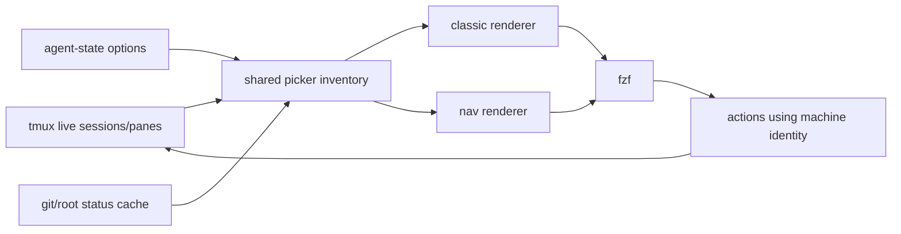

# ADR-0001 — Retain FZF and Introduce Sidebar-Style `xtmux nav`

**Status:** Accepted
**Date:** 2026-08-14
**Repository:** `Jaggerxtrm/xtmux`
**Decision scope:** local tmux session/pane navigation and picker presentation
**Out of scope:** xtmux runtime authority, persistence redesign, Herdr runtime adoption, native TUI implementation

## Topology model (amended 2026-08-17 — NAV-T8)

The shipped navigator projects tmux's real hierarchy, explicitly correcting the
earlier two-level model:

```text
previous:
session
  pane

new:
session
  window
    pane
```

Identity is machine-owned and stable at every level:

```text
$ = session identity
@ = window identity
% = pane identity
```

- Window index and window name are presentation only. Display text never
determines action identity: every action resolves the hidden token
(`s:$N`, `w:$N:@N`, `p:$N:%N`) and revalidates ownership against live tmux
before mutation (window → its live owning session; pane → its live session).
- Windows are independently selectable rows (`Enter` selects the exact
`@window_id`); panes are grouped under their real windows.
- Pane location (repo, `repo · relative-path`, worktree → canonical repo
label) is first-class sidebar context in expanded mode; full absolute paths
remain details-only behind the inspector.
- Compact mode emits session rows only; expanded mode emits session → window →
pane. This amendment supersedes any two-level session → pane wording below.

## Context

xtmux has evolved from a small tmux picker into a coordination runtime with live agent-state awareness, durable messages, monitors, handoffs, runtime identity, topology, audit and recovery surfaces.

The interactive picker has not evolved at the same rate.

The current fzf surface remains operationally capable, but its presentation model is still dominated by:

```text
one fzf record
→ one dense display line
→ many concatenated metadata tokens
```

Session and pane rows can include identity, state, repository, branch/status information, idle age, Bead context, task metadata, specialist metadata, path information and other signals on one line.

The right preview then consumes a large share of available width.

The resulting interface is information-rich but difficult to scan, particularly when many agent sessions are active.

Herdr demonstrates several useful navigation ideas:

```text
sidebar-oriented navigation
multi-row metadata
active-item visibility
workspace/worktree hierarchy
compact and expanded presentations
next/previous navigation
priority ordering
```

Those UX ideas fit xtmux.

Herdr's runtime architecture does not.

## Decision

xtmux will retain **fzf as the v1 interactive navigation engine** and introduce `xtmux nav` as the canonical enhanced operator navigation surface.

The implementation will redesign presentation and navigation while preserving the existing runtime and authority model.



The navigator is a projection over existing truth.

It does not own session state, agent state, work authority or durable coordination state.

## Decision 1 — One inventory, multiple renderers

Session/pane discovery, state normalization, attention ranking, repository grouping and cached git metadata must remain shared.

The architecture is:

```text
inventory construction
├── classic renderer
└── nav renderer
```

It is not:

```text
classic picker implementation
+
independent nav implementation
```

This prevents presentation modes from disagreeing about which sessions exist or which agent needs attention.

## Decision 2 — Public list contracts remain compatible

The existing newline/TSV-oriented `list` surface must not be converted into the record protocol required by multi-line fzf entries.

The nav UI will use an internal renderer.

This separates:

```text
operator/CLI projection
from
interactive fzf transport
```

Existing JSON, dashboard and topology contracts remain unchanged unless an additive change is independently justified.

## Decision 3 — Machine identity is separate from visual text

The navigator must never derive an action target by parsing its visual row.

A nav record contains hidden machine fields and a presentation field.

Conceptual contract:

```text
type<TAB>session_id<TAB>session_name<TAB>target<TAB>action_token<TAB>display<NUL>
```

Example:

```text
pane    $42    xtmux-ui    %17    p:$42:%17    <multi-line display>
window  $42    coord        @17   w:$42:@17    <multi-line display>
session $42    xtmux-ui    $42    s:$42       <multi-line display>
```

The first fields are machine-owned.

The display field is presentation-only.

This rule applies to single-row actions and multi-select/bulk actions.

## Decision 4 — Multi-line fzf records are capability-gated

Multi-line records are desirable because they permit:

```text
line 1: identity + state
line 2: repository/worktree context
line 3: optional child-pane detail
```

The implementation may use fzf NUL-delimited records only after the installed/supported fzf version is characterized locally.

Exact syntax must come from the installed fzf help, not memory.

If a safe multi-line implementation is not supported by the required fzf compatibility range, xtmux must fall back to a compact one-line nav renderer.

Unsafe shell parsing is not an acceptable fallback.

## Decision 5 — Enter acts directly on hidden identity

The preferred fzf control flow changes from:

```text
fzf
  return selected rendered row
shell
  parse selected row
  jump
```

to:

```text
fzf
  selection
    use hidden identity fields
    become/execute exact xtmux action
```

This avoids capturing NUL-delimited records into Bash variables and reduces coupling between rendering and action dispatch.

## Decision 6 — `xtmux nav` is additive

The initial command family is:

```text
xtmux nav
xtmux nav next
xtmux nav prev
xtmux nav attention-next
xtmux nav attention-prev
xtmux nav back
xtmux nav help
```

`xtmux nav` opens the interactive navigator.

`next` and `prev` wrap native tmux session order.

`attention-next` and `attention-prev` cycle the existing xtmux attention ordering.

`back` reuses the existing previous-target mechanism.

Existing picker invocation remains compatible.

## Decision 7 — Popup geometry belongs to tmux

`xtmux nav` does not create a second windowing abstraction.

Sidebar/drawer appearance is achieved through tmux popup geometry.

Conceptual binding:

```tmux
bind s display-popup -E -x 0 -y 0 -w 40% -h 75% 'XTMUX_NAV_WIDTH=$(tput cols) $HOME/.local/bin/xtmux nav'
```

This syntax was verified with tmux 3.5a. The intended sidebar is 38–40%; widen
to 44–50% for long session names or 55–60% on a small terminal. The launcher
subtracts eight cells for fzf border/selection chrome before bounding rows.
The popup is 75% of the viewport height, and the `#222222` background uses a
terminal-dependent alpha (`@200`) so supported terminals render it slightly
transparent. Nothing is bold: rows, `%pane-id`, and agent state labels
differ by color only.

A classic/full-width binding remains available, and `XTMUX_NAV_LAYOUT=classic`
selects it without changing runtime behavior.

## Decision 8 — Drawer information hierarchy is intentionally sparse

`../mockups/xtmux-nav-sidebar-target.html` is the visual-direction reference, not
an implementation technology. Sessions sort as attention, active, then other.
Every selectable record carries compact `attn`, `active`, or `other` group
identity; no heading record can disappear under fuzzy filtering. Session and
pane rows also retain the exact state. Rows wrap onto continuation lines
rather than being cut: the default drawer never emits an ellipsis. The
one-line fallback (fzf builds without multiline records) keeps deterministic
truncation because a single physical line cannot exceed the terminal width.
A session renders as:

```text
▎ xtmux-ui                    2m  urgent wait
    xtmux · nav sidebar · +2
    ▸ @17  0:coord  wait · 2
        %17  claude  sidebar picker  wait
        %19  shell                 wait
```

Each window is an independently selectable row under its session. Each expanded
child pane uses one bounded line and keeps its operational id visible:

The primary list should not display every known metadata field.

Full paths, prompt files, parent identity, timestamps, pane geometry, long task text and expensive enrichment belong in the inspector.

## Decision 9 — Current target and selected target are different concepts

The navigator shows both:

```text
▎ current tmux target
› current fzf selection
```

The current target should be derived from live invocation identity, preferably `TMUX_PANE` plus the already-collected pane inventory.

It must not require another persistent state record.

## Decision 10 — Preview becomes an inspector

The preview should present structured metadata:

```text
SESSION
AGENT
WORKTREE
terminal capture
```

rather than concatenate all metadata onto one line.

Drawer mode provides a bottom inspector, hidden until the explicit `Ctrl-/`
details toggle. Classic mode may retain the right-side inspector.

## Decision 11 — Live state freshness is non-negotiable

The existing caching rule remains:

```text
cache:
  expensive near-static git/root/status information

do not cache:
  rendered rows
  agent state
  attention ordering
  waiting/running filter result
```

No UI improvement may reintroduce stale agent state.

The redesign must also avoid adding per-pane git or process-tree work to the normal warm list path.

## Decision 12 — Classic mode is the rollback path

The new navigator must retain a classic renderer/layout selector.

Preferred operator rollback:

```text
XTMUX_NAV_LAYOUT=classic
```

or an equivalent explicit setting.

Classic and drawer modes consume the same inventory.

Rollback changes presentation, not semantics.

## UI structure

```text
<xtmux nav>
  <Inventory>
    live tmux identity
    agent-state normalization
    attention ranking
    git cache
  <NavRenderer>
    <SessionRow>
      identity + state
      repo + branch + dirty + age
      <WindowRow>
        @window-id + index:name + aggregate state + pane count
        <PaneRow>
          %pane-id + runtime + state
          location line
    <SectionHeader>
  <FzfNavigator>
    fuzzy search
    structured filters
    compact/expanded toggle
    machine-field actions
  <Inspector>
    session
    agent
    worktree
    terminal capture
```

## Navigation algorithm

```text
attentionCycle(direction)
  rows = current authoritative attention list

  if rows is empty
    report "no attention targets"
    return

  current = invoking pane

  if current is not in rows
    target = first row when direction is next
    target = last row when direction is previous
  else
    target = adjacent row with wraparound

  record previous target
  jump to target
```

## Characterization evidence

Local characterization on 2026-08-14 used tmux 3.5a and fzf package 0.60.3 (`fzf --version` reports `0.60 (devel)`). The probe verified all of these behaviors by action payload, not appearance:

```text
--read0 preserves two NUL-delimited records with embedded display newlines
{5} resolves the hidden action-token field
{+5} passes selected action tokens as separate quoted arguments
become and execute dispatch supported commands
reload-sync and track-current preserve the machine record boundary
```

The installed build does not apply `--accept-nth` in `--filter` mode. The capability gate must therefore use an ephemeral PTY and explicit action payloads. It must not use `--filter` as acceptance proof.

The supported fallback order is:

```text
multiline nav  when all semantic probes pass
one-line nav   when machine-field actions pass but multiline behavior does not
classic picker when machine-field actions cannot be proven safe
```

Installed tmux syntax also establishes that ordinary session traversal uses `switch-client -n`, `switch-client -p`, and `switch-client -l`. tmux 3.5a has no separate `next-session` or `previous-session` commands.

## Consequences

Positive consequences:

```text
substantially less clipping at sidebar widths
better visual hierarchy
faster session scanning
clearer current-location awareness
simpler sequential navigation
no new runtime
no new state authority
compatibility with existing tmux workflows
```

Costs:

```text
fzf record/action plumbing becomes more explicit
multi-select actions need machine-token refactoring
rendering needs narrow-width tests
docs and help must distinguish nav from classic presentation
supported fzf capabilities must be characterized
Bash truncation counts characters, not terminal cells; wide/combining Unicode may wrap
```

These are acceptable costs because they remove implicit coupling that already exists between display strings and actions.

## Alternatives rejected

### Replace fzf with a native Rust/Go/TypeScript TUI now

Rejected for this workstream.

The current interaction requirements are within fzf's likely capability envelope, and replacing the UI engine would create unnecessary implementation and maintenance surface before fzf has been proven insufficient.

A native TUI remains a future option.

### Adopt Herdr as the xtmux runtime

Rejected.

Herdr's runtime model overlaps with responsibilities xtmux already owns differently. This ADR adopts navigation ideas only.

### Continue adding metadata to the current one-line renderer

Rejected.

The problem is structural. More truncation rules cannot create a usable information hierarchy.

### Put all metadata in preview and keep one minimal row

Rejected as the only mode.

This improves density but loses useful second-line context such as branch, dirty state and short agent task information.

The chosen design uses bounded multi-row context plus a full inspector.

### Store navigator state in the V2 database

Rejected for v1.

Filter/view UI state may remain lightweight UI state. Navigation presentation does not require a new durable domain.

## Acceptance criteria

The ADR is satisfied when:

```text
1. `xtmux nav` exists as an additive interactive surface.

2. Existing public list/JSON/dashboard/topology behavior remains compatible.

3. Classic and nav renderers consume the same state/inventory logic.

4. The default nav presentation fits useful session information into a narrow popup
   without depending on one unbounded display line.

5. Machine action identity is isolated from display text.

6. Multi-line display cannot alter jump, kill, rename, message or bulk-action targets.

7. Fzf multi-line capability is characterized and has a safe fallback.

8. The current tmux target is visually distinct from the current fzf selection.

9. Session next/previous navigation is available through `xtmux nav`.

10. Attention next/previous cycles the existing authoritative attention ordering.

11. Jump-back remains compatible.

12. The inspector uses structured metadata sections.

13. Agent-state freshness is unchanged.

14. Warm navigation does not introduce unjustified hot-path subprocess growth.

15. A classic presentation rollback remains available.

16. Contract, JSON/help, typecheck and relevant repository gates pass.

17. The implementation PR remains unmerged until independent review.
```

## Future decision triggers

A new ADR is required before any of the following:

```text
replacing fzf with a native TUI
creating a persistent nav daemon
persisting seen/unseen/favorite navigation state in SQLite
adding remote multi-host mutation/navigation authority
making nav own worktree lifecycle
changing tmux as the session authority
```

Those changes are not implied by this ADR.
