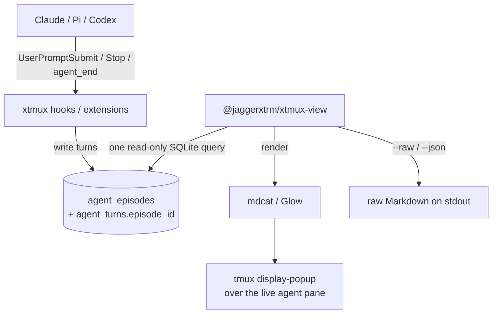
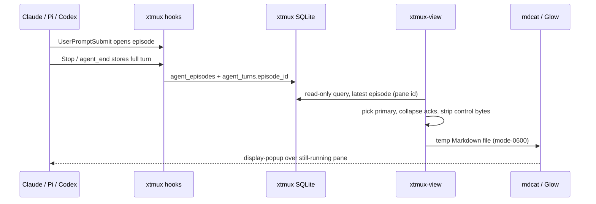

# @jaggerxtrm/xtmux-view

Rich Markdown overlays for completed Claude Code, Pi, and Codex turns managed by xtmux.

This package is deliberately separate from `xtmux nav`. The picker remains a navigation index. `xtmux-view` is a presentation layer over the raw agent TUIs.

## Architecture



The package does **not** use `capture-pane`, scrape ANSI output, mutate the xtmux database, poll the agent process, or participate in picker rendering. Each command performs one indexed read, then hands a rendered document to a terminal Markdown renderer over a popup that leaves the underlying agent TUI untouched.



## Requirements

- xtmux with response-episode capture (`agent_episodes` + `agent_turns.episode_id`, migration 0014; targeted for xtmux v0.3.0). Against an older schema the viewer degrades to the previous single-row read.
- Bun
- tmux for popup mode
- [mdcat](https://github.com/swsnr/mdcat) for the default rich Markdown renderer (renders Mermaid natively)
- [Glow](https://github.com/charmbracelet/glow) >= 2.1.0 as the fallback renderer (`--renderer glow`)

Renderers are intentionally external rather than reimplemented here. `auto` prefers `mdcat` and falls back to `glow`. This package owns runtime/session integration, not Markdown layout technology.

## Local install

From the xtmux repository:

```bash
cd packages/xtmux-view
bun link
```

Install Glow with your platform package manager, for example:

```bash
brew install glow
```

Then verify the environment:

```bash
xtmux-view doctor
```

## Usage

From an xtmux-managed Claude, Pi, or Codex pane:

```bash
xtmux-view
```

This opens the latest completed response episode in a tmux popup while the underlying TUI remains untouched.

Target another pane or stable session explicitly:

```bash
xtmux-view '%553'
xtmux-view '$42'
```

Inspect the normalized source without rendering:

```bash
xtmux-view --raw '%553'
xtmux-view --json '%553'
```

Render in the current terminal instead of creating a popup:

```bash
xtmux-view --no-popup '%553'
```

## Suggested tmux binding

```tmux
# Rich view for the pane that owns the current key context.
bind m run-shell 'xtmux-view "#{pane_id}"'
```

The package also accepts popup sizing through environment variables:

```bash
XTMUX_VIEW_POPUP_WIDTH=88%
XTMUX_VIEW_POPUP_HEIGHT=90%
XTMUX_VIEW_GLOW_STYLE=dark
```

## Runtime behavior

`xtmux-view` always reads the **latest response episode** for a canonical `%pane` or `$session` id. An episode is one user prompt plus all Claude continuations caused before control returns to the operator (Stop-hook block follow-ups); its `agent_turns` rows are candidates. The rendered document is conservative by contract:

- the first substantive candidate is the **primary response**;
- later substantive candidates render as **follow-up** sections;
- short hook acknowledgements ("Acknowledged.") are **collapsed** into a footer and never replace the primary — a response holding a Mermaid diagram survives a later short Stop candidate.

Pane ids remain visible in the rendered document because they are operational handles for multiplexing and inter-agent communication.

The package uses the existing unified xtmux turn capture:

- Claude Code: UserPromptSubmit hook opens the episode; the Stop hook stores each turn's full assistant text as a candidate (`last_assistant_message` preferred, transcript fallback).
- Pi: native extension publishes the full assistant turn at `agent_end`.
- Codex: lifecycle hook publishes the full assistant turn.

No runtime-specific transcript parsing belongs in this package unless the xtmux turn-capture contract cannot supply the content.

## Mermaid

With the default renderer, `mdcat` renders Mermaid fences natively (real diagrams with typographic styling); the fence is handed through untouched. Supported types: `graph`/`flowchart`, `sequenceDiagram`, `classDiagram`, `erDiagram`, `stateDiagram(-v2)`, plus `mdcat`'s own broader coverage. A broken fence degrades to the source. `--raw` and `--json` never render Mermaid; the transform runs only in the rich render path.

When falling back to `glow` (`--renderer glow`), Mermaid fences are rendered to ASCII box-drawing inside a plain code fence first. The padding preset is chosen by popup width (default/compact/tight/squeezed), and lines still wider than the popup are clipped with a hint. A fence that is unsupported, oversized, or fails to parse is left as the original ```mermaid source so Glow shows it verbatim.

Glow's ASCII rendering is best-effort: `mermaid.parse` cannot fully validate headlessly (see Security and performance), so only a genuine parse error preserves the source — the ASCII renderer itself does not throw on malformed input.

## Security and performance

The database is opened read-only. Targets are restricted to canonical `%N` and `$N` identities. Assistant content is never interpolated into a shell command and terminal control bytes are stripped before display. The rich renderer receives a mode-0600 temporary Markdown file which is deleted when the renderer exits.

Mermaid is imported lazily only when a fence is present. `mermaid.parse` needs a browser sanitizer that is absent headlessly, so valid HTML-bearing diagrams (flowchart/class/state) surface a DOMPurify error that is treated as "unvalidated → render" rather than broken.

The normal path performs one indexed SQLite read plus one Glow TUI process. It does not enumerate tmux panes, invoke git, scan process trees, or affect picker latency.

## Scope

v0.1 renders the latest response episode only. Future work can add transcript navigation and follow mode while preserving the same read-only boundary. Mermaid renders via `mdcat` natively, or as ASCII box-drawing under the `glow` fallback; rasterized images await a terminal image-protocol renderer.
